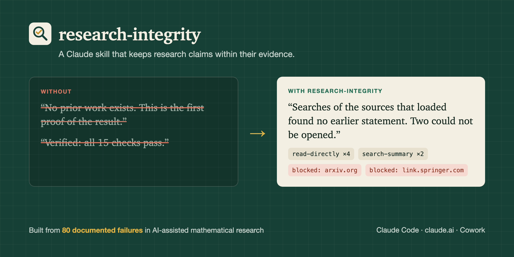
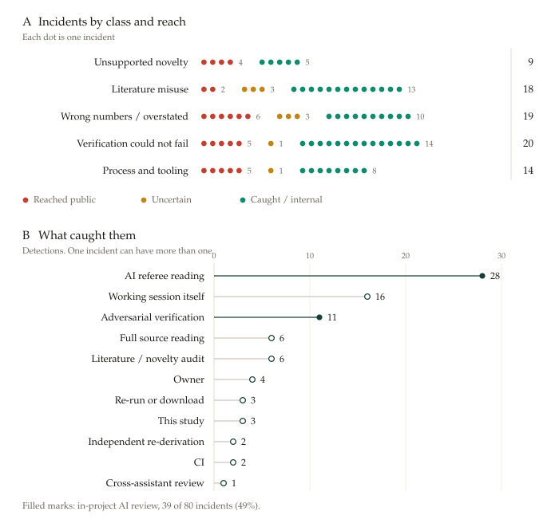

<p align="center"></p>
<h1 align="center">research-integrity</h1>
<p align="center">A Claude skill that keeps research claims within their evidence.</p>

<p align="center">
  <a href="https://github.com/ChaseHendrick/Research-Integrity/actions/workflows/validate.yml"></a>
  
  
  <a href="LICENSE"></a>
</p>



AI research assistants rarely fail by inventing things from nothing. They fail by **claiming more than their evidence supports**:
- a literature search that could not reach the journals is read as proof that a result is new;
- a check that cannot fail is reported as passed;
- an abstract is cited as if the paper had been read.

Each looks reasonable, and none announces itself.

This skill makes Claude show its evidence at every step: how each claim is known, what each search could and could not reach, and whether each check could have failed. It encodes the controls that caught **80 documented failures** in two weeks of AI-assisted mathematical research across nine preprints. These are documented in the case study [*Eighty Failures*](docs/case-study/ai-research-failure-modes.md) ([PDF](docs/case-study/ai-research-failure-modes.pdf)).

It is plain instructions: no scripts, no network access, no API key.

## Install

### Claude Code

```
/plugin marketplace add ChaseHendrick/Research-Integrity
/plugin install research-integrity@research-integrity
```

Restart the session if the skill does not appear. Claude loads it on its own when you do research work, or you can call it directly with `/research-integrity`.

### claude.ai and Cowork

1. Download `research-integrity.zip` from the [latest release](https://github.com/ChaseHendrick/Research-Integrity/releases/latest).
2. In Claude, open **Settings → Capabilities → Skills** and upload the ZIP.
3. Turn the skill on.

### Copy it by hand

Copy [`plugins/research-integrity/skills/research-integrity/`](plugins/research-integrity/skills/research-integrity/) into `~/.claude/skills/` for every project, or into `.claude/skills/` in one repository.

## What changes

| Situation | Without the skill | With the skill |
|---|---|---|
| A search finds nothing | "No prior work exists." | "No earlier statement in the sources that loaded; arxiv.org and link.springer.com could not be opened." |
| Only a search summary was seen | Cited as if the page was read | Labelled `search-summary`, and never used for a proof step |
| A result looks new | "This is the first …" | Searches for the closed form first, and states novelty only within the search's reach |
| A verification script prints OK | "Verified." | Asks what wrong input the script rejects, and runs mutations to show it can fail |
| A proof is drafted | The drafting session checks its own work | A separate session is told to find errors, and others try to refute its findings |
| An AI reviewed the paper | "Independently reviewed" | "Read by a separate AI session; not an outside review" |
| A release gate fails | The gate is adjusted so the release passes | The release waits, or the change to the gate is recorded with its reason |

[See worked examples →](docs/EXAMPLES.md)

## The seven rules

1. **Label every claim with how it is known**: `read-directly`, `abstract-only`, `search-summary`, `repository` or `reasoning`.
2. **Record what could not be searched.** A blocked source goes in the log, never into "no results".
3. **Never infer novelty from a search**, or from a numerical check that succeeded.
4. **Every check must be able to fail**, as shown by failure controls and mutation testing.
5. **Review adversarially, then doubt the reviewer.** The drafting session never checks its own fixes.
6. **Label review honestly.** An AI reading is not peer review.
7. **Do not bend a gate to fit a release.**

The full text, with a pre-release checklist and a table of phrases to avoid, is in [`SKILL.md`](plugins/research-integrity/skills/research-integrity/SKILL.md).

## Where the rules come from

The rules were written after the failures happened, not before. They come from [GENChase](https://github.com/ChaseHendrick/GENChase), a public research workspace in which AI assistants (mainly Claude Code, with smaller contributions from Grok, Codex and ChatGPT) produced nine mathematical preprints between 19 September and 3 October 2026. The workspace recorded every correction as it happened, so each failure can be traced to a file, line and commit.

| Failure class | Incidents | Reached a public release |
|---|---:|---:|
| Unsupported novelty or priority | 9 | 4 |
| Literature misuse | 18 | 2 |
| Wrong numbers, overstated results | 19 | 6 |
| Verification that could not fail, or did not exist | 20 | 5 |
| Process and tooling | 14 | 5 |
| **Total** | **80** | **22** |

The worst single failure: five results were announced as "the first public source of these formulas". The supporting search could not open most journals. An audit later found the results in papers from 1877 and 1987, and **zero** of the five were new.

In-project AI review was the control that caught the most: separate sessions told to find errors caught 39 of the 80 incidents (49%).



- **[Read the case study](docs/case-study/ai-research-failure-modes.md)** ([PDF](docs/case-study/ai-research-failure-modes.pdf)), 17 pages, with related work, an independent coding check (κ = 0.91) and two figures.
- **[Download the incident dataset](docs/case-study/incidents.csv)**: 80 rows, each with class, date, verbatim evidence, detecting control and reach.
- **[See the evidence for each rule](docs/EVIDENCE.md)**.

## Coverage and limits

- **It changes what Claude says, not what Claude can reach.** If your network policy blocks arXiv or publisher sites, the skill makes Claude say so; it cannot open them. In Claude Code cloud environments, set **Network access** to **Full** or add the hosts under **Custom**.
- **It relies on the model following it.** It is guidance, not enforcement. Long sessions and summaries can still drop details, so check the search log yourself before relying on a negative result.
- **AI review is not peer review.** The skill makes in-project review more adversarial and labels it honestly. It does not replace outside review.
- **It is tuned for mathematics and computational science.** The rules about claims, searches and checks apply widely. The checklist assumes proofs and verification programs, so adapt it for other fields.

## Privacy

The skill is a single Markdown file of instructions. It runs no code, makes no network requests and stores nothing. Anything Claude fetches while following it goes through Claude's normal tools and your normal settings.

## Development

```sh
python3 scripts/validate.py
```

This checks the marketplace file, the plugin manifest and the skill's frontmatter, and runs on every push. With Claude Code installed you can also run `claude plugin validate . && claude plugin validate ./plugins/research-integrity --strict`.

See [CONTRIBUTING.md](CONTRIBUTING.md) to propose a rule, and [CHANGELOG.md](CHANGELOG.md) for versions.

## Cite

If you use this skill or its evidence in your work, cite it with the metadata in [CITATION.cff](CITATION.cff) (GitHub's **Cite this repository** button).

## License

[Apache-2.0](LICENSE). Use it, fork it and adapt it for your own field.
