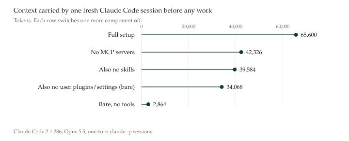

# Eighty Failures: Error Modes and Controls in AI-Assisted Mathematical Research

**A case study of two weeks in the GENChase research workspace**

Chase Hendrick · Hendrick Research · ORCID [0009-0002-9754-6087](https://orcid.org/0009-0002-9754-6087)

Version 1.14 · 4 October 2026 · Case study, not peer reviewed

---

## Abstract

AI coding assistants are used to search literature, write proofs, build verification programs and prepare preprints. This case study reconstructs the recorded failures of one human-directed project, GENChase, in which those assistants produced nine mathematical preprints between 19 September and 3 October 2026. The source is the public repository at commit `98e7fc4`. The study is not a claim to be the first record of this kind. Section 1.1 names earlier case studies and taxonomies, and states how far each was read.

The record contains **80 incidents in five classes**:

- unsupported novelty or priority (9);
- literature misuse (18);
- wrong numbers or overstated results (19);
- verification that could not fail or did not exist (20);
- process and tooling failures (14).

Twenty-two reached a public artifact, eight are uncertain, and fifty were caught before release or never left internal notes.

Separate referee sessions account for 28 detections and an adversarial verification workflow for 11. No incident carries both, so that is 39 of 80 (49%). The owner is a detector on 4, and requested the audit of the five identities. A separate session of Claude Sonnet, shown each short name and evidence quote and not these labels, agreed on 74 of 80 classes (Cohen's κ = 0.905). That session is not an outside reader. The largest public failure was five results presented as first-public, after a search that could not open most journals. The audit found that zero of the five were new.

By recorded date, the public novelty claims N1–N3 and the wrong verification figures fall before the quality bar of 25 September. Three public incidents dated 27 September (N4, L10, L11) are dated by the day they were written down. One wrong model description reached a released preprint after the bar: cardiac-rings 1.1.0 (W18). The other public incidents dated after 25 September are release or review-process failures (P1–P3, P14) or one studio comparison (W14). These dates are an observation about this record, not an effect of the controls.

---

## 1. Introduction

The common worry about AI research assistants is fabrication: invented citations and hallucinated results. This case shows a subtler and more frequent problem. Most failures here were not inventions from nothing. They were **claims that outran their evidence**: a negative search treated as a positive finding of novelty, a check that could not fail reported as a passed check, an abstract read as if it were the paper, a number taken from a mislabeled metric. Each looks reasonable, and none announces itself.

GENChase offers an unusual vantage point because its assistants were instructed to record their own corrections. The research ledger (`RESEARCH.md`, 2,180 lines) logs every search, every blocked source and every retraction. Quality records accompany every paper. Referee notes record in-project reviews. Because these records were kept as the work happened, the failure history can be reconstructed from evidence rather than from memory.

This study asks three questions:

1. **What kinds of errors** does AI-assisted mathematical research produce, and how often?
2. **Which controls caught them**, and which errors escaped every control?
3. **What should change**, in research practice and in the tools?

### 1.1 Related work

Version 1.5 said that no such record was known to us. That sentence is withdrawn. The search that replaces it, and what it did not open, is in the Use of AI section. What follows uses only those readings.

**Autonomous systems.** Lu et al. (2024) introduced *The AI Scientist*, which generates ideas, runs experiments and writes papers end to end. Beel, Kan and Baumgart (2025) found that its literature reviews "produced poor novelty assessments, often misclassifying established concepts … as novel", that 42% of its experiments failed from coding errors, and that some papers contained hallucinated numerical results. Trehan and Chopra (2026) report four attempts to generate machine-learning papers with a pipeline of agents. Three failed in implementation or evaluation. They name six modes, including declaring success on a failed run. Feng et al. (2026) grade an autonomous agent, Aletheia, on Erdős problems: of 200 candidates they could mark, 13 (6.5%) were meaningfully correct, and 50 of the technically correct solutions answered a reading of the problem they judged unintended. Fei et al. (2026) annotate 800 trajectories on 100 research tasks and publish a taxonomy of 45 failure patterns, including claims with no run behind them. That taxonomy was not read pattern by pattern; the count 45 and the description of the corpus are from the abstract and the section that introduces it.

**One-shot mathematics.** Banerjee and Bhattacharjee (2026) name four modes in research-level proofs — citation fabrication, premise smuggling, silent reformulation, and a gap between local steps and a global argument — and audit eight one-shot proofs. None was correct. They report no confirmed fabricated citation in those eight, and at least one unjustified load-bearing premise in each. They state that eight proofs are too few for a population claim. Guo et al. (2025) score solutions of 200 examination and contest proofs and list ten error types, among them hidden assumptions and incomplete proofs. Collins et al. (2024) taxonomize how people query a model while proving undergraduate problems. Their taxonomy is of human queries, not of model errors, and the problems are not open research. This revision read their abstract and significance statement, not the paper.

**Human-directed projects that already keep a record.** Three of these are the reason the contribution sentence of version 1.5 does not stand.

Weinhold (2026) documents a two-week collaboration, with the author mediating between models, that produced proofs of two theorems in mathematical economics. From that documentary record she states five error types: overbuilding before a numerical check, shortcuts whose hypotheses fail once the state moves, premature certification in which the text and the computation disagree, stale output from a long context, and assumptions that survive until a hostile audit. She compares the case with Collins et al. (2024) and says her taxonomy is of the model's errors in a production collaboration. The proofs had not, at the date of that paper, been read by a human mathematician. The record is not a public table of every incident with a detector and a reach.

Li et al. (2026) report about 240 sessions, from 16 June to 24 July 2026, on bounds for the Grothendieck constant, with people steering and with Claude Code in the harness. They record a numerical caveat that did not survive later summaries, an upper bound that was withdrawn, and a feasibility criterion proved in session 8 and lost until an audit 25 days later. They write: "To the best of our knowledge, this work is the first in-depth case study of a long-horizon human–AI collaboration on a mathematical research program." That claim is theirs, bounded by their search, and this paper does not adopt it. Their failures are narrated. They are not coded as a complete incident list.

Bui-Thanh (2026) reports about two months of human–AI work on Hermite quadrature error bounds, and says a benchmark does not show the dead ends of an actual project. The failure modes he names are narrative: a plausible identity that was false, a verification the model declared finished that had missed factorials, and proofs that assumed what they claimed to prove. He states that he reviewed every AI-drafted sentence. There is no incident table.

Yeung (2026) is the closest published case to class V. Over five weeks an LLM coding agent wrote the search and the verifiers for a coding-theory problem, and a human chose the problem, set the verification protocol and redirected between sessions. The paper gives the failures the same space as the new bounds. The first sweep stopped at 116 words and recorded the last symmetry class as topping out at 112; a later session, with a stronger operator, found 120. A later note that the method did not carry to length 7 was wrong for the same reason. An earlier sweep, which the paper says cost three weeks, reported an optimum over "all subgroups" from a parameterisation that could not express all of them: three conjugate cells, which must share an optimum, were summarised as 100, 92 and 8, while the results file marked them unproven. Yeung's conclusion is the one this record keeps meeting: an intermediate result was written down, never rechecked, and then used as a fact that ruled out further search, and a protocol that checks final outputs does not catch that. The account is a narrative with a repository of the search code. It is not a coded list of every incident with a detector and a reach.

**Citations and checks, measured apart from a project.** Walters and Wilder (2023) examined 636 citations in 84 ChatGPT-generated papers: 55% of GPT-3.5 citations and 18% of GPT-4 citations were fabricated, and substantive errors remained in 43% and 24% of the real ones. That is generated bibliography, not a project ledger. This record contains almost no wholly fabricated citation. The literature failures here are unread sources, misstated theorems, and search summaries taken for sources. Wang, Xu, Briand and Liu (2025) report test suites with 100% coverage and a 4% mutation score. Class V is the same gap in a proof harness: 13 of 16 integrator mutations passed every check. Smyth et al. (2026), read as an abstract only, define overclaiming as a final response that reports work the transcript does not show, for example a file the agent says it read and did not open.

**What this paper adds.** It does not add a new general taxonomy, and it is not the first case study of a human directing AI through a mathematical project. Weinhold, Li et al., Bui-Thanh and Yeung already published those. It does not measure models against each other. What it adds is one public repository, commit `98e7fc4`, in which the corrections were written down as the work happened: 80 incidents, each with a file and line or a commit, a detecting control and a reach, and a second coding of the class labels. The second coding is in `incidents.csv`. The selection of the 80 was not independently repeated.

**Not claimed.** The class counts are counts of recorded incidents, not of all errors, and not rates that transfer to another project. In-project review is not peer review. Agreement on class is not a replication of the incident list. Section 5.3 does not estimate an effect of the controls. Nothing here is a finding about one model: the repository does not say which model wrote a given sentence.

## 2. Setting

**The workspace.** GENChase ([github.com/ChaseHendrick/GENChase](https://github.com/ChaseHendrick/GENChase)) is a single-author research and simulation workspace. Over the study window it produced:

- nine preprints, the `ready` entries in `papers/papers.json` at this commit, with 55 distinct Zenodo version DOIs in that file, on point-vortex collapse, neural-field and Hodgkin–Huxley traveling waves, the classical double pendulum, eigenspectra of neural population codes, and rotating waves in rings of cardiac cells;
- a draft software paper;
- a browser-based studio of scientific simulations.

**The assistants.** Most work was done in Claude Code sessions, including cloud sessions with a sandboxed network. Grok worked on the repository from about 27 to 29 September and on the cardiac study on 1 October. OpenAI's Codex ran part of the cardiac computations around 30 September and 2 October, and ChatGPT was used in small amounts. Of the 315 commits at `98e7fc4`, 102 carry a `Claude-Session:` trailer and 8 carry `Co-authored-by: Claude`, counted from `git log` on 4 October 2026. In the 15 calendar days from 19 September to 3 October the same count is 59 trailers and 8 co-author lines, out of 245 commits. Version 1.8 said 58 of 151, and seven co-author lines. A trailer shows that a commit was made from a Claude Code session. It does not show which model wrote a given sentence, and a missing trailer does not mean another assistant did the work. **This study therefore does not attribute individual errors to individual models.**

**The owner's role.** The owner set direction, made editorial decisions, fetched papers the sandbox could not reach, and approved releases. Several controls in this study began as owner instructions.

## 3. Method

**Source.** The repository at commit `98e7fc4` (3 October 2026), read without modification. `git rev-list --count 98e7fc4`, run on 4 October 2026, is 315 commits, dated from 17 September 2026 to 3 October 2026. Version 1.8 said the history started at a root commit on 22 September and contained 151 commits. Neither sentence matches this commit.

**Unit of analysis.** An *incident* is a recorded instance in which a claim, number, check, citation or process step was wrong or unsupported, and the repository records it being found. Where one report bundles several related findings, they form a single incident.

**Coding.** Each incident was coded for:

- **class** (Section 4);
- **date and commit**;
- **evidence**: a verbatim quote with its file and line;
- **detecting control**: owner (OWN), literature or novelty audit (AUD), separate-agent referee reading (REF), adversarial verification workflow (AVW), independent re-derivation (IND), full reading of a source (REV), re-run or download check (RUN), the working session itself (SELF), or continuous integration (CI);
- **reach**: public, uncertain, or caught/internal.

"Public" means the error was present in a tagged GitHub release, a companion or Zenodo release, or the repository while it was public. Where this could not be established, the incident is marked *uncertain*.

**Verification of the evidence.** Version 1.5 reported that 260 file-and-line quotations had been checked mechanically, and that three claims had been re-executed: the v0.5.0 tag still contains the wrong agreement figure, the v0.6.2 tag still contains the factor-2 eigenvalues, and the paper quality check fails at the hh-pulse release commit. This version did not re-run those checks. `code/check_numbers.py` does not re-open GENChase.

**Coder.** The evidence base was compiled by an AI agent (Claude, in Claude Code) under the owner's direction. The incidents are drawn from the repository's own records, which were themselves largely written by AI sessions. Section 8 discusses what this implies.

**Reliability of the classification.** A second coder classified all 80 incidents. The coder was Claude Sonnet in a separate session. It saw only each incident's short name and evidence quote, under shuffled identifiers, and a written codebook, and it did not see these labels. It agreed on **74 of 80** classes. Cohen's κ is **0.905**. Chance agreement is 1356/6400 = 0.211875, from the two label margins. Both figures are recomputed from `incidents.csv` by `code/check_numbers.py`. The six disagreements are W14 (W against V), W15 (W against P), V13 (V against W), V16 (V against W), V19 (V against P) and P14 (P against V). V16 is a README that printed the agreement values `1 ; 1` with no measurement: a check with nothing to check, or a wrong number. The status line that printed "Poisson solved" unconditionally is V15, and both coders marked it V. Version 1.5 gave that line as the example of a disagreement. That example was wrong, and the confidence ratings it also reported were not deposited, so they are not reported here. The codebook shown to the second coder is not in this repository. Agreement was measured for class only. Reach and detecting control were not re-coded.

**Rates.** Incident dates run from 19 September to 3 October, 15 calendar days, with one incident undated. Those 15 days contain 245 of the 315 commits. The record contains 80 incidents: about 5.3 per calendar day, one per 3.1 commits in that window, and 8.9 per preprint. These are rates of recorded and corrected failures, not of all failures. The nine preprints are the entries in `papers/papers.json` at this commit whose status is `ready`. The software paper is a draft and is not one of the nine. The 55 Zenodo version DOIs are the distinct `10.5281/zenodo.` identifiers in that same file, counted on 4 October 2026.

## 4. A taxonomy of failures

Table 1 gives the five classes and their reach.

**Table 1. Incidents by class and reach.**

| Class | Incidents | Reached public | Uncertain | Caught / internal |
|---|---:|---:|---:|---:|
| N. Unsupported novelty or priority | 9 | 4 | 0 | 5 |
| L. Literature misuse | 18 | 2 | 3 | 13 |
| W. Wrong numbers, overstated results | 19 | 6 | 3 | 10 |
| V. Verification that could not fail or did not exist | 20 | 5 | 1 | 14 |
| P. Process and tooling | 14 | 5 | 1 | 8 |
| **Total** | **80** | **22** | **8** | **50** |

### 4.1 Class N: unsupported novelty and priority

The most serious failure in the record, and the origin of most later controls.

**Case N1–N2: five "first public" identities.** Early in the project, the workspace presented five closed-form results on point-vortex collapse as new and publicly first. The supporting literature search could not open most journals: the ledger notes "Blocked: … Most journals." It concluded that the results "were not in those sources". At the owner's request, the work was reopened "to verify all five against the internet". A full reading of Gröbli (1877) then reproduced the first candidate from his original equations. Kimura (1987) was later found to give the governing ratio explicitly. The audit's conclusion, now the first line of the ledger:

> "Confirmed novel findings among the five candidates: 0." (`RESEARCH.md:11`)

The audit document states that it "supersedes the repository's earlier unqualified claims of being the first public source of these formulas" (`identities/NOVELTY-AUDIT.md:6`). A personal name given to one classical result was also retired (N3). The pattern is the central lesson of this study: **the absence of evidence was reported as evidence of absence, and novelty was asserted from a search that could not have found the prior work.**

Later novelty overclaims were caught by referee readings before release:

- the rank-window note's central point was anticipated and uncited (N6);
- the hh-dynamics novelty statement overreached (N7);
- the double-pendulum and hh-pulse priority statements rested on papers that were read only through search snippets or not at all (N8, N9).

In each case the statement was narrowed to what the search had actually reached.

### 4.2 Class L: literature misuse

Eighteen incidents involve how sources were found, read and cited. Three mechanisms recur.

**Blocked access read as absence (L1, L2).** The cloud sandbox's network policy blocked arXiv, Springer, Crossref, OpenAlex, Semantic Scholar, Wikipedia and most journal sites. The ledger records sessions that searched sites which never loaded "and then write 'I did not find it' as if those sites had loaded" (`RESEARCH.md:306`).

**Search summaries treated as sources (L3, L4).** The web search tool returns a model-written summary of results. Twice the summary asserted something no source supported:

- it claimed a May 2024 preprint of a paper for which no preprint could be found (`RESEARCH.md:239`);
- it attributed a publisher's generic preprint policy to a specific journal. A verifying agent identified this as "the search model's inference, not text from any RCD or Pleiades page" (`docs/wip/research-2026-09-24-unverified.md:395`).

**Citing what was not read (L6–L17).** These include:

- a claim resting on a paper that "was not read" (L6);
- a source's printed value said to match for two examples when it matched one (L12);
- Hastings's theorem misstated, and the wrong paper cited (L14);
- a theorem with five conditions reported as unconditional (L15);
- misrepresentations of the Smale–Birkhoff theorem (L16);
- wrong titles, pages and credits (L10, L13, L17);
- in the cardiac-rings manuscript, a reading cited that did not exist (L18).

Referee readings or full source readings caught most of these before release. Two reached the public, both in a superseded identities note that sat in the public repository (L10, L11). Three more may have (L1, L6, L9).

### 4.3 Class W: wrong numbers and overstated results

**Case W18: a model described wrongly in a released paper.** The cardiac-rings 1.1.0 preprint described its cell model in two ways that did not match the equations actually solved. It applied a capacitance ratio to calcium terms that do not carry it, and it described holding intracellular potassium fixed as a restriction of the full model when it in fact changes the equations. A formula audit on 3 October found both, the day after release. The source was corrected, and the note records that "the released 1.1.0 PDF and immutable tag remain untouched" (`papers/cardiac-rings/notes/model-correction-rebuild-2026-10-03.md:4`). The theorems themselves concern the stated model and were not affected. A second cardiac-rings reading also found "two wrong numbers in statements" before the first release (W19).

**Case W1: the mislabeled metric.** A verification table reported agreement of 6 × 10⁻²⁵. The figure "came from a mislabeled metric in `verify_general_mu.py`; the true figure is 4.5 × 10⁻²¹", and 13 values had been checked, not 12 (`RESEARCH.md:155`). The wrong figure shipped in release v0.5.0, whose tag still contains it. It was corrected the same day, and a rule followed: every verification claim in a paper must map to a committed check.

Other numeric errors that reached a release:

- Hessian eigenvalues printed for 2P instead of P (W5, v0.6.2);
- a configuration announced as a collapse that in fact expands; its mirror image collapses (W6, v0.6.2 notes);
- two studio defects: one compared plates against an infinite-size limit, so correct plates read as wrong (W14), and a silently overwritten parameter meant every plate of one model ran at v = 2 whatever the slider said (W15).

The overstated-result incidents were caught by referee readings before release:

- theorem domains claimed larger than proved (W8);
- "exact" values that rested only on numerical enclosures (W11);
- a "no replication" verdict that overstated a weak held-out test (W12);
- abstract wording such as "rarely or not at all" without uncertainty (W13).

### 4.4 Class V: verification that could not fail, or did not exist

This is the largest class and the hardest to see. A check that cannot fail looks exactly like a check that passed.

**Case V1–V3: the nf-pulse harness.** An adversarial verification workflow ran four independent checkers in parallel on 26 September: mathematics, code audit with mutation testing, an independent reimplementation that never read the original code, and prior-article search. It found:

- a check whose grep pattern "matches the line printed on success and on failure" (`papers/nf-pulse/review/MATH.md:295`);
- a Jacobian test where "an error of 4.7e-2 still prints OK" (`papers/nf-pulse/review/VERIFY.md:72`);
- a configuration under which the harness "prints all 15 OK, while the proof log records `cone_pd False`" (`VERIFY.md:59`);
- that "13 of the 16 integrator mutations still pass all 15 checks" (`VERIFY.md:63`).

The code checker and the mathematics checker found the first defect independently.

**Claimed but nonexistent verification (V4–V7, V9, V12–V14).** Recorded instances include:

- "The claimed consistency check of the manifold recursion did not exist" (`papers/nf-pulse/ext/faye-model/REPORT.md:289`);
- a README describing written proofs that did not yet exist (V5);
- a hypothesis the paper says a program verifies, which "is not checked by any program" (`papers/double-pendulum/notes/review-1.md:64`);
- a quality item ticked before the readings it certified had been recorded, so that merging "would have synced the unread additions to the public companion" (V12).

**Tautologies (V8, V10, V11, V15–V17).** These include:

- a negative control that "cannot fail to fail" (V8);
- a symbolic check that compared a polynomial with itself reordered (V11);
- simulation status lines printing "Poisson solved" unconditionally and "mass conserved" with no measurement (V15);
- README agreement values of "1 ; 1" that were later "removed rather than transformed into invented zero-error measurements" (V16).

**Stale evidence (V20).** During the cardiac-rings 1.1.0 work, a review found that "the Hopf bridge could consume older point-proof successes without current-source binding" (`docs/HANDOFF-2026-10-02-cardiac-rings-1.1.0-codex.md:65`): a proof step could have been satisfied by results computed from an earlier version of the source. The program was changed to bind each result to the exact source it came from.

The studio-side incidents (V15–V17) reached public releases before an uncertainty gate was added on 24 September. Of the paper-side incidents in this class, all were caught before release except possibly one: V14, a fix list that called two items done that were not.

### 4.5 Class P: process and tooling

**Case P1: a bypassed quality gate.** On 28 September the hh-pulse paper was marked ready while two of its seven quality items, including the adversarial second reading, were still open. The repository's own check fails at that commit; re-running it today reports "the quality bar is not met (open: item 6, 7)". The preprint was archived with a Zenodo DOI anyway. Five hours later, a change to the checking tool made an already archived paper with open items report them rather than fail. The open items were closed the next day and the owner chose not to withdraw. This is the clearest case in the record of a **control being weakened to accommodate the failure it caught**, and the record does not show who triggered the release.

Other process incidents:

- release notes that said papers were attached when the release script had stopped (P2);
- a Zenodo archive missing its manuscript PDF (P3);
- invented co-author trailers on `main` after a rule against them existed (P4);
- an arXiv endorsement asserted as unnecessary when it was required (P9);
- research verification stopped "to save usage", leaving 179 of 236 gathered claims never verified (P6);
- work that existed only in an ephemeral cloud container (P7);
- for cardiac-rings, the check that a referee's must-fix findings had been fixed was made by the drafting session itself, and the fixes from the third reading "have not been read by a further reader" (P14, `papers/cardiac-rings/notes/QUALITY.md:256`, `:262`).

## 5. The controls

### 5.1 What caught what

**Table 2. Detecting control, counted across the 80 incidents.** An incident may have more than one detector.

| Control | Incidents detected |
|---|---:|
| Separate-agent referee reading (REF) | 28 |
| The working session itself (SELF) | 16 |
| Adversarial verification workflow (AVW) | 11 |
| Full reading of a source (REV) | 6 |
| Literature or novelty audit (AUD) | 6 |
| Owner (OWN) | 4 |
| Re-run or download check (RUN) | 3 |
| This study | 3 |
| Independent re-derivation (IND) | 2 |
| CI | 2 |
| Cross-assistant review | 1 |

Sorted by how many incidents each control caught. Eleven incidents had no control named in the first coding. Version 1.6 assigns each from the record that holds the correction: the working session's ledger (N5, W1, W5, W6, W7, W14, V16, V17), the repair of release 0.8.0 (P2), and this study's check of the git history (P4, P5). Class and reach are unchanged.

**In-project AI review, from referee readings and adversarial workflows, detected 39 of 80 incidents (49%).** Referee notes typically open with a disclaimer such as: "An in-project reading by a separate AI agent (a headless Claude session started for it) … It is not an outside review."

These readings were consistently productive:

- six readings of the hh-dynamics paper found 18 surviving findings, five of them must-fix, in the first three alone;
- four readings of minimal-winding 2.2.0 found ten confirmed serious findings.

### 5.2 The protocol at the end of the window

By 3 October the workspace had converged on the following controls. Each traces to incidents in Section 4. This is not a description of the skill as it stands now. Section 5.4 records what version 1.1.0 added after the window.

**Provenance labels for every claim.** A gathered claim carries an access label: `read-directly`, `search-summary`, `repository`, `reasoning` or `legal-text`. "Do not take a search summary as a reading" (`RESEARCH.md:140`).

**A written record of search limits.** A standing table lists what the sessions could and could not open. "A negative result is weakest of all where the likeliest home for the thing is a site in the right-hand column" (`RESEARCH.md:324`). Every search is logged with its query, what was opened, what was blocked and its conclusion: "If you are an agent and you did not search, do not invent a row" (`RESEARCH.md:865`).

**A bounded meaning for "new".** "Claim originality from a numerical check or unsuccessful literature search" is forbidden (`RESEARCH.md:302`). Results take descriptive titles, never personal names, and classical sources are credited (`AGENTS.md:19`).

**Checks that can fail.** "A check that cannot miss is not a check" (`AGENTS.md:161`). Every numerical record needs a `failureControl`, defined as "a deliberate wrong result or implementation change that the test detects". Comparisons without a stated basis are refused by code, and a lint fails any value printed against a reference by hand.

**A seven-item quality bar, enforced by a tool.** The items are: complete proofs; rigorous computation in exact or interval arithmetic with negative controls; every claim labelled; every source a proof depends on read in full; a logged prior-article review; an adversarial second reading by a reviewer "told to find errors, briefed only with the paper and its programs"; and reproducibility. "A second reading that is only planned does not" count (`docs/PUBLISHING-PAPERS.md:65`).

**Skeptic agents.** Before a referee's finding is applied, two further agents are told to refute it. Some findings did not survive. On rank-window, two of five must-fix findings were dropped this way.

**Honest review labels.** "No text may claim an outside review that has not taken place" (`AGENTS.md:66`).

**Release verification.** Every Zenodo archive is downloaded and checked for its manuscript PDF. "A new `RELEASES.md` heading is not evidence" (`docs/PUBLISHING-PAPERS.md:176`).

### 5.3 Timing

By recorded date, N1–N3, the wrong numbers in v0.5.0 and v0.6.2 (W1, W5, W6), and the studio checks V15–V17 fall before these controls:

- the uncertainty gate (24 September);
- the seven-item quality bar (25 September);
- the adversarial verification workflow (26 September).

N4 does not. N4, L10 and L11 are the three public incidents dated 27 September. L10 and L11 are the credit and hypothesis errors in the superseded identities note (Section 4.2). N4 is priority wording left in a statements file. This paper dates them by the day they were recorded. It does not give a separate git date for the commit that introduced each one. Version 1.5 grouped N1–N4 together as predating the controls. That grouping is not what the recorded dates say.

The public incidents dated after 25 September are those three, the studio comparison W14, the release and review-process incidents P1, P2, P3 and P14, and the cardiac-rings model description W18. V14, a fix list that called two items done that were not, is dated 28 September and is marked uncertain, not public. W18 shipped in cardiac-rings 1.1.0 and was found by a formula audit the next day. The window is short and the sample is one project. This section is a description of these dates, not a measured effect.

### 5.4 What the skill added after the window

The skill in this repository, version 1.1.0, was committed on 4 October 2026, after the source commit of this study (`98e7fc4`, 3 October). It keeps the controls in Section 5.2 and adds the rows below. Each row answers an incident already in the record. None of these sentences was a control during the window, and this study does not measure them.

| Added in skill 1.1.0 | Incident it answers |
|---|---|
| A status on every claim: `proved`, `computer-assisted`, `cited`, `numerical`, or `conjectured`. An enclosure is not an exact value, and a numerical result is not a proof step. | W11, V13 |
| A cited theorem is applied only after its hypotheses are checked against this instance. Dropped conditions are not an unconditional theorem. | L11, L15 |
| Every public number is copied from a named field of the run that produced it, and the claimed domain is the proved domain. | W1, W7, W8, W10 |
| A failure control must fail for the reason under test. A control that fails for a side reason, or that cannot fail to fail, is not a control. | V7, V8 |
| A search, check, or review that was cut short, or that exists only in an uncommitted container, is not a pass. | P6, P7, P8, P11 |
| When a priority sentence is withdrawn, it is deleted from every file that can ship, not only from the note that records the withdrawal. | N4 |
| A review note names every AI tool that wrote, searched, checked, or reviewed. | P13 |
| No co-author trailer is added for an identity that was not checked. | P4 |

Skill release 1.2.0 adds a rule this table does not contain. The release gate is a committed program that recomputes public counts and fails on a planted fault (`scripts/gate.py`). It answers a checklist ticked or edited so a release could proceed (P1, V12), and the version 1.8 commit counts, which no program rejected. It was not a control during the window. Release 1.3.0 makes that program optional: on for this repository, off unless a project asks. Release 1.4.0 adds a local hook and server that do not open a network connection. The hook blocks a write only when the project asks. Release 1.4.1 changes how those programs are started and adds a listing icon. Release 1.4.2 stops those scripts from computing a path. None of this was a control during the window. The current skill release is 1.4.2.

## 6. Discussion

**The dominant failure is overreach, not invention.** Of the 80 incidents, few involve material invented from nothing. The search-summary artifacts (L3, L4) and the invented co-author trailers (P4) come closest. Most are claims stated more strongly than the evidence allowed. The failure is in calibration, so the remedy is to make evidence strength visible at every claim, not just to check facts.

**Blocked access is a correctness problem.** A literature search that cannot reach the literature does not produce a weak result; it produces a misleading one, because it is read as negative. The single most damaging incident in this study (N1–N2) follows directly from a network policy. Two things would have prevented it: tooling that reported which sources were unreachable, and conclusions that stated their reach. Unreachable sources need not be blocked hosts. In our session-overhead measurements, the first headless session after login carried 43,240 tokens of context, against about 65,600 for every later run of the same command. That matches the configuration with MCP connectors switched off to within about 900 tokens, so the run very likely started before its connectors had connected, and nothing in its output said so. A literature-search connector that silently fails to load produces the same "nothing found" as a search that found nothing ([anthropics/claude-code#99400](https://github.com/anthropics/claude-code/issues/99400)).

**The same patterns are already reported elsewhere.** Class N, a known result treated as new, is what Beel, Kan and Baumgart (2025) reported for an autonomous system, and what the identities audit found here. A load-bearing claim with nothing behind it is Banerjee and Bhattacharjee's (2026) premise smuggling, in eight one-shot proofs, and Weinhold's (2026) premature certification, in a two-week proof. A check that cannot fail is the gap Wang, Xu, Briand and Liu (2025) measure by mutation score. Smyth et al. (2026), from the abstract only, measure a final answer that reports a file read the transcript does not show. A caveat that does not survive a handoff, and later certifies a bad bound, is the failure Li et al. (2026) record. An intermediate numerical result written down once and then used to stop the search is the failure Yeung (2026) documents across five weeks of a coding-agent search: the protocol checked final outputs and still missed it. This project did not discover the patterns. It counts them for one public repository, with the control that caught each incident. The near absence of a wholly fabricated citation, set next to Walters and Wilder (2023), is a difference of task. One project does not show that fabrication has become rare.

**Verification needs its own verification.** Twenty incidents concern checks that could not fail or did not exist, or that could be satisfied by stale results. An AI assistant asked to build a verification harness will build one that passes, and a passing harness is not evidence. Mutation testing, negative controls with a specific expected failure reason, and independent reimplementations that never read the original code were the techniques that found these defects.

**In-project AI review works, within limits.** Separate agent sessions told to find errors were the most productive control in the record. They are not outside review. They share the training, blind spots and literature access of the sessions they check. When two checkers verified the same 26 claims, they agreed on only 12, and ten claims were "confirmed" by one and "unverifiable" by the other. Disagreement between AI checkers is information; agreement is not proof.

**The controls that work are the ones that cost the most to run.** The most productive controls were fresh, separate sessions: referee readings, adversarial checkers, and two skeptic sessions per finding. Each fresh session pays a fixed context cost before doing any work. We measured that cost on the same tooling (Claude Code 2.1.286, one-turn sessions). It was about 34,000 tokens with nothing installed and about 65,600 with this project's plugins and connectors. Desktop agent sessions in the author's logs started at about 152,000 tokens. Built-in tool definitions alone were about 31,000 tokens and MCP connectors about 23,000. A finding checked by one referee and two skeptics therefore costs three cold starts before anyone reads a line. Usage limits then bear directly on integrity. In this record, verification was stopped "to save usage", leaving 179 of 236 claims unverified (P6), and another session paused "for the owner's usage reset". Appendix B gives the full measurements; they are also documented in [anthropics/claude-code#99400](https://github.com/anthropics/claude-code/issues/99400), and the breakdown in [anthropics/claude-code#80527](https://github.com/anthropics/claude-code/issues/80527).

**Controls erode under release pressure.** The hh-pulse case (P1) shows a gate that worked, a release that went ahead regardless, and a tool change hours later that stopped the gate from failing. Controls that can be edited by the same process they constrain need a record of every relaxation.

## 7. Recommendations

### 7.1 For researchers using AI assistants

1. **Label every claim with how it is known**: read in full, abstract only, search summary, or reasoning. Never let a search summary stand in for a reading.
2. **Write down what could not be searched**, and state novelty only within that reach. Treat "I did not find it" as worthless when the likeliest source was unreachable.
3. **Give every check a failure control** and test it with mutations. A check that has never failed has not been tested.
4. **Use separate adversarial sessions** to review proofs and code, then use skeptic sessions to test the reviewers' findings. Record disagreements.
5. **Label in-project review honestly.** An AI reading is not peer review.
6. **Make release gates tamper-evident.** Record every relaxation of a gate with its reason and the release it unblocked.

### 7.2 For builders of AI research tools

These follow from the incidents and are framed as requests. Several are filed on the Claude Code issue tracker.

1. **Provenance in search results.** Web-search summaries should separate what a page says from what the summarizer infers, and every assertion of existence should carry a URL. Filed as [anthropics/claude-code#99385](https://github.com/anthropics/claude-code/issues/99385).
2. **Report unreachable sources as a result.** When a fetch is blocked by policy, the tool output should say so in a form the model cannot mistake for an empty result. The record of unreachable sources should also carry through summaries and subagent reports, so that "nothing found" always arrives with "and these sources could not be opened". Filed as [anthropics/claude-code#99389](https://github.com/anthropics/claude-code/issues/99389).
3. **Research network presets.** Sandboxed cloud sessions should offer a scholarly allowlist (arXiv, DOI resolvers, major publishers, Crossref, OpenAlex, Semantic Scholar) as a one-click option.
4. **Visible and reservable search budgets.** The session's search budget should be visible, and a verification stage should be able to reserve part of it. See [anthropics/claude-code#91723](https://github.com/anthropics/claude-code/issues/91723).
5. **First-class adversarial verification.** A built-in verify step should run independent checkers, mutation tests and negative controls, and report what it could not check as unverified rather than refuted.
6. **Respect project identity and policy.** Harness hooks should not instruct the agent against a repository's written rules, for example rewriting commit authorship. See [anthropics/claude-code#69201](https://github.com/anthropics/claude-code/issues/69201).
7. **Durable work in ephemeral sandboxes.** Background results in cloud sessions should persist, or the user should be warned before a container is reclaimed.
8. **Cheaper fresh sessions for verification.** Because adversarial review multiplies cold starts, independent checkers should be able to run with a minimal tool set by default. Usage-limit pressure should never be what decides whether a verification stage runs. Scheduled jobs that only run a script should not start a model session at all; this is filed as [anthropics/claude-code#99400](https://github.com/anthropics/claude-code/issues/99400).

## 8. Limitations

- **Single case, short window.** One workspace and one owner. At the cited commit the git history runs from 17 September to 3 October 2026 (315 commits). Recorded incidents are dated 19 September to 3 October, one of them undated. The incidence of each class will differ elsewhere.
- **Recorded incidents only.** The study sees only errors the workspace recorded finding. Undetected errors are by definition absent, so the counts are a lower bound, and the share caught by each control is a share of what was caught at all.
- **The record was written largely by AI sessions**, and the evidence base was compiled by an AI agent. The quotations were checked mechanically against the source, and the classification was checked by a second coder (Section 3), but the selection of incidents was not independently replicated.
- **Attribution.** Commit trailers show which tool session committed work, not which model wrote any sentence. No incident here should be read as a finding about a specific model.
- **Earlier history.** Version 1.8 said events before 22 September were dated only by the notes, and that the history began that day. Commits exist from 17 September, including on 19, 20 and 21 September. The incident dates are still the dates the notes record, not a separate date for the commit that introduced each error.
- **Coding judgment.** A second Claude model agreed on the class of 74 of 80 incidents (κ = 0.905). It is not an outside reader. Reach and detecting control were coded once. The second coder's confidence ratings were not deposited. Version 1.6 fills the eleven controls that coding had left unnamed, from the record of the correction; class and reach were not changed. Several are marked uncertain in the appendix.
- **Dates.** Incidents are dated by when they were recorded, not by when the error was introduced (Figure 2). N4, L10 and L11 are the cases where that distinction matters in the public counts.
- **What the programs check.** `code/check_numbers.py` recomputes Table 1, the detector counts and κ from `incidents.csv`. `code/make_figures.py` writes Figures 1 and 2. Neither program re-opens GENChase. The count of 260 quotations, the three re-executions named in Section 3, and the session-overhead measurements were not re-established for this version.
- **The skill is later than the window.** Section 5.2 is the protocol on 3 October. Section 5.4 is skill 1.1.0, the program gate in 1.2.0, the choice in 1.3.0 to leave that gate off unless a project asks, and the local hook and server in 1.4.0. The 80 incidents do not test those sentences. The current skill release is 1.4.2.
- **The prior-article search is bounded.** It did not open MathSciNet, zbMATH, Scopus or Web of Science. Section 1.1 is not evidence that no further case study exists.

## 9. Conclusion

Over the recorded window, GENChase contains 80 incidents of the five classes above. The largest public one was a novelty claim built on a search that could not reach the literature. The largest class was checks that could not fail or did not exist. Public incidents dated before the quality bar include that novelty claim and wrong verification figures. Public incidents dated after it include N4, L10 and L11, the cardiac-rings model description, a studio comparison, and failures of the release process. The control that caught the most incidents was a further AI session told to find errors. That is a count in this repository. It is not a claim that the pattern was unknown, or that the controls have a measured effect.

---

## Data availability

All evidence for the incidents is in the public repository [ChaseHendrick/GENChase](https://github.com/ChaseHendrick/GENChase) at commit `98e7fc4`. A reference `path:N` opens as `https://github.com/ChaseHendrick/GENChase/blob/98e7fc4/path#LN`. The incident table is `incidents.csv` (80 rows: class, the second coder's class, date, evidence, detecting control, reach). From that file, `python3 docs/case-study/code/make_figures.py` writes Figures 1 and 2, and `python3 docs/case-study/code/check_numbers.py` checks Table 1, the detector counts, κ and those figures against the manuscript. Section 5.2 is the protocol at the end of the window. The skill in this repository is that protocol plus Section 5.4. The current skill release is 1.4.2. The session-overhead measurements are not regenerated by those programs; their commands are in [anthropics/claude-code#99400](https://github.com/anthropics/claude-code/issues/99400).

## Use of AI

The incident list and version 1.5 of this manuscript were drafted with Claude (Opus 5.5) in Claude Code. An AI agent compiled the evidence base under the author's direction. The second coding was Claude Sonnet in a separate session. Version 1.6 assigned the eleven unnamed detectors from the correction record. Version 1.7 withdrew the contribution sentence and compared Yeung (2026). Version 1.8 records that skill 1.1.0, committed after the study window, is not the protocol in Section 5.2. Version 1.9 replaces the commit counts that did not match `98e7fc4`. Version 1.10 names skill release 1.2.0. Version 1.11 records that release 1.3.0 makes the program gate optional. Version 1.12 records the local hook and server in release 1.4.0. Version 1.13 records the directory packaging fix in release 1.4.1. Version 1.14 records release 1.4.2, which stops the launch scripts from computing a path. Versions 1.7 to 1.14 were drafted with Grok under the author's direction on 4 October 2026.

Sources carried forward from version 1.5 (Lu et al., Beel et al., Si et al., Walters and Wilder, Wang et al., Gröbli, Kimura) had been read at abstract level. For version 1.7 the new comparisons were read as follows. Weinhold (2026): the author's PDF, for the title, the five error types, the comparison with Collins et al., and the stated limitations; the proofs were not checked. Li et al. (2026): the arXiv HTML, including the failure narratives and the sentence claiming a first in-depth case study. Bui-Thanh (2026): the arXiv PDF, for the failure-mode passages and the claim to document a real project; the quadrature proofs were not checked. Banerjee and Bhattacharjee (2026): the arXiv PDF, for the taxonomy, the eight-proof audit and the stated limitations. Trehan and Chopra (2026) and Guo et al. (2025): the arXiv HTML, for the setting, the failure lists and the stated scope. Feng et al. (2026): the arXiv HTML section that contains the Erdős grading (their Table 5); the rest of that paper was not read for this revision. Fei et al. (2026): the abstract and the passage that states the 45 patterns; the patterns were not read one by one. Smyth et al. (2026) and Collins et al. (2024): abstract, and for Collins the significance statement. Yeung (2026): the arXiv HTML, for the abstract, the three failure narratives (the 112 recorded as a maximum, the length-7 verdict, and the three-week sweep) and the statement that checking final outputs does not catch an unchecked intermediate; the new code bounds were not re-run. The author is responsible for the content.

The queries, on the open web, were: "case study AI-assisted mathematical research failure modes human in the loop"; "LLM research assistant errors novelty hallucination verification"; "AI Scientist evaluation Beel"; "citation fabrication ChatGPT systematic"; "autonomous AI research agent failure modes overclaiming"; "Collins et al. 2024 taxonomy LLMs mathematical"; and, for this version, "human-directed mathematical case studies 2026" and "Yeung coding agents coding theory". MathSciNet, zbMATH, Scopus and Web of Science were not opened. A negative result was not drawn from that fact. Pages found and not used as comparisons, because they were not read past a search snippet or an abstract, include a formalization-workflow survey (Collins, Frieder, Bayer and others, arXiv:2606.04273) and a pipeline paper that says its system claimed correct proofs of all ten First Proof problems and that the authors fully checked one of them (Meng and others, arXiv:2602.13695). Neither is cited in Section 1.1.

## Ethics

This study involves no human participants. It reports the author's own project, including errors that reached public releases. Incidents are described by what the record shows, without attributing them to individual AI models, because the record cannot support that attribution.

## Conflicts of interest

None. The author is the owner of the workspace studied and of the Research-Integrity skill.

## References

1. Beel, J., Kan, M.-Y., & Baumgart, M. (2025). Evaluating Sakana's AI Scientist: Bold claims, mixed results, and a promising future? arXiv:2502.14297.
1. Gröbli, W. (1877). *Specielle Probleme über die Bewegung geradliniger paralleler Wirbelfäden*. Inaugural dissertation, Georg-August-Universität Göttingen; printed by Zürcher und Furrer, Zürich. English translation: arXiv:2404.01305.
1. Kimura, Y. (1987). Similarity solution of two-dimensional point vortices. *Journal of the Physical Society of Japan*, 56, 2024–2030. doi:[10.1143/JPSJ.56.2024](https://doi.org/10.1143/JPSJ.56.2024).
1. Lu, C., Lu, C., Lange, R. T., Foerster, J., Clune, J., & Ha, D. (2024). The AI Scientist: Towards fully automated open-ended scientific discovery. arXiv:2408.06292.
1. Si, C., Yang, D., & Hashimoto, T. (2024). Can LLMs generate novel research ideas? A large-scale human study with 100+ NLP researchers. arXiv:2409.04109.
1. Walters, W. H., & Wilder, E. I. (2023). Fabrication and errors in the bibliographic citations generated by ChatGPT. *Scientific Reports*, 13, 14045. doi:[10.1038/s41598-023-41032-5](https://doi.org/10.1038/s41598-023-41032-5).
1. Wang, G., Xu, Q., Briand, L., & Liu, K. (2025). Mutation-guided unit test generation with a large language model. arXiv:2506.02954.
1. Banerjee, A., & Bhattacharjee, A. (2026). Failure modes of large language models on research-level mathematics: a taxonomy and an empirical characterisation. arXiv:2606.24902.
1. Bui-Thanh, T. (2026). The AI research assistant: a proof of concept. arXiv:2602.22842.
1. Collins, K. M., Jiang, A., Frieder, S., Wong, L., Zilka, M., Bhatt, U., Lukasiewicz, T., Wu, Y., Tenenbaum, J. B., Hart, W., Gowers, T., Li, W., Weller, A., & Jamnik, M. (2024). Evaluating language models for mathematics through interactions. *Proceedings of the National Academy of Sciences*, 121(24), e2318124121. doi:[10.1073/pnas.2318124121](https://doi.org/10.1073/pnas.2318124121). Read: abstract and significance statement.
1. Fei, Y., et al. (2026). How do agents fail on AutoResearch: end-to-end diagnostic evaluation on 100 real-world frontier research tasks. arXiv:2608.14905. The arXiv record's author list is longer than one name; this revision did not rely on a partial byline.
1. Feng, T., Trinh, T. H., Bingham, G., et al. (2026). Towards autonomous mathematics research. arXiv:2602.10177. The author list on the arXiv record is longer than these three names.
1. Guo, D., et al. (2025). Mathematical proof as a litmus test: revealing failure modes of advanced large reasoning models. arXiv:2506.17114.
1. Li, A., Saha, R., Xue, A., Chaudhuri, S., Klivans, A., Kothari, P. K., & Meka, R. (2026). Long-horizon AI research for the Grothendieck constant: a case study in human–AI mathematical collaboration. arXiv:2608.11195.
1. Smyth, N., Mantilla-Ramos, Y.-J., Tikeng Notsawo, P. J., Helbling, S., Tosato, A., Merzouk, M. A., Dziri, N., Gidel, G., & Tosato, T. (2026). Quantifying overclaiming propensity in frontier LLM agents. arXiv:2609.20812. Read: abstract.
1. Trehan, D., & Chopra, P. (2026). Why LLMs aren't scientists yet: lessons from four autonomous research attempts. arXiv:2601.03315.
1. Weinhold, D. (2026). How a non-theorist and two AIs proved a theorem: anatomy of a human–AI collaboration in mathematical economics. Working paper, 16 April 2026, Department of International Development, London School of Economics. [PDF](https://personal.lse.ac.uk/weinhold/papers/Weinhold_HumanAI_Theorem.pdf).
1. Yeung, A. (2026). Coding agents for coding theory. arXiv:2609.39081. Code: [github.com/Abraham-y/coding-agents-coding-theory](https://github.com/Abraham-y/coding-agents-coding-theory).
1. GENChase repository, commit `98e7fc4`, files cited in text: `RESEARCH.md`, `AGENTS.md`, `identities/NOVELTY-AUDIT.md`, `docs/PUBLISHING-PAPERS.md`, `papers/*/notes/QUALITY.md`, `papers/*/notes/referee-*.md`, `papers/nf-pulse/review/VERIFY.md`, `papers/nf-pulse/review/MATH.md`, `docs/wip/research-2026-09-24-unverified.md`.

---

## Appendix A. Incident index

Reach: **P** reached public · **?** uncertain · **C** caught before release or internal. Detector codes as in Section 3.

| ID | Incident | Detected by | Reach |
|---|---|---|---|
| N1 | Three-vortex "uniqueness" concluded from a search that could not open most journals; result is in Gröbli 1877 and Kimura 1987 | AUD, REV | P |
| N2 | Five identities presented as first-public; audit found zero novel | AUD | P |
| N3 | Personal name given to a classical result | OWN | P |
| N4 | Priority wording left in a fingerprinted statements file | REF | P |
| N5 | Published equations given private names in draft | SELF | C |
| N6 | Rank-window central point anticipated and uncited | REF | C |
| N7 | hh-dynamics novelty statement overreached | REF | C |
| N8 | Double-pendulum novelty rested on search snippets | REF | C |
| N9 | hh-pulse priority rested on two unread papers | REF | C |
| L1 | "I did not find it" on sites that never loaded | SELF | ? |
| L2 | Network policy blocked most scholarly hosts; conclusions from abstracts | SELF | C |
| L3 | Search summary asserted a preprint that could not be found | SELF | C |
| L4 | Search summary attributed a generic publisher policy to a specific journal | AVW | C |
| L5 | Truncated quotes and a mixed-up citation in gathered research | AVW | C |
| L6 | Claim rested on an unread paper | REV | ? |
| L7 | Prior work under-credited | REV | C |
| L8 | Paper already read was called unread | SELF | C |
| L9 | Wording and credit errors in paper 1 | REF | ? |
| L10 | Credits misattributed in the retired identities note | REF | P |
| L11 | Source result asserted while assuming its hypothesis | REV | P |
| L12 | Source value said to match for two examples; matched one | REF | C |
| L13 | Wrong published title and page for two sources | REV | C |
| L14 | Hastings's theorem misstated; wrong paper cited | REF | C |
| L15 | Theorem with five conditions reported as unconditional | AVW | C |
| L16 | Smale–Birkhoff theorem misrepresented; ratio misquoted | REF | C |
| L17 | A slip misattributed; theorem credited only to a secondary source | REF | C |
| L18 | Cardiac-rings manuscript cited a reading that did not exist | REF | C |
| W1 | Agreement 6 × 10⁻²⁵ from a mislabeled metric (true 4.5 × 10⁻²¹) | SELF | P |
| W2 | Witness value used a misprinted source formula | IND | ? |
| W3 | Floor reported on one branch; lower minimum missed | IND | ? |
| W4 | Six-vortex geometry wrongly declared unable to collapse | REV | ? |
| W5 | Hessian eigenvalues printed for 2P, not P | SELF | P |
| W6 | Configuration announced as a collapse actually expands | SELF | P |
| W7 | Digits rounded instead of truncated | SELF | C |
| W8 | Theorem claimed on a larger set than proved | REF | C |
| W9 | Stale check counts; "two controls" where there are three | REF | C |
| W10 | Theorem proved at 6.2999999999999998 °C; unsupported bound; numbers not in certificates | REF | C |
| W11 | "Exact" values rested only on enclosures | REF | C |
| W12 | "No replication" overstated a weak held-out test | REF | C |
| W13 | Claims beyond outputs; uncertainty missing from abstract | REF | C |
| W14 | Studio plates compared with an infinite-size limit | SELF | P |
| W15 | Studio parameter silently overwritten (every plate at v = 2) | AUD | P |
| W16 | Print audit overstated its own findings | AVW | C |
| W17 | Suggestions relayed from another assistant overstated prior work | cross-assistant review | C |
| W18 | Cardiac-rings 1.1.0 described its model wrongly (capacitance scope, potassium clamp) | AUD | P |
| W19 | Two wrong numbers in cardiac-rings theorem statements | REF | C |
| V1 | Harness check matched success and failure lines; test printed OK for any value | AVW | C |
| V2 | Harness passed a failing proof with assertions disabled | AVW | C |
| V3 | 13 of 16 integrator mutations passed all checks | AVW | C |
| V4 | Block labelled "certified" was not the block the proof uses | AVW | C |
| V5 | README described proofs that were not written | AVW | C |
| V6 | Claimed consistency check did not exist; report was an unfinished template | AVW | C |
| V7 | Parameter range never checked; negative controls failed for side reasons | AVW | C |
| V8 | Negative control that cannot fail to fail | REF | C |
| V9 | Hypothesis said to be program-verified was checked by no program | REF | C |
| V10 | Proposition check cannot fail in practice | REF | C |
| V11 | Symbolic check compared a polynomial with itself | REF | C |
| V12 | Quality item ticked before the readings it certified existed | REF | C |
| V13 | Program said to prove a quantity it only encloses | REF | C |
| V14 | Fix list called two items done that were not | REF | ? |
| V15 | Status lines printed "Poisson solved" unconditionally | AUD | P |
| V16 | README agreement values "1 ; 1" with no measurement | SELF | P |
| V17 | Tautological and preview-hidden checks shipped | SELF | P |
| V18 | Sharpness tool sampled half the pixels and called sharp plates featureless | AUD | P |
| V19 | Escape helper escaped nothing | CI | P |
| V20 | Hopf proof step could accept results from an older source version | REF | C |
| P1 | Paper archived with two quality items open; gate then weakened | RUN, OWN | P |
| P2 | Release notes said papers were attached; they were not | RUN | P |
| P3 | Zenodo archive missing its manuscript PDF | RUN | P |
| P4 | Invented co-author trailers after a rule against them | this study | P |
| P5 | Scratch folder landed on main despite its own instruction | this study | ? |
| P6 | Verification stopped to save usage; 179 of 236 claims never checked | SELF | C |
| P7 | Work existing only in an ephemeral container | SELF | C |
| P8 | Audit stopped before its verification stage | SELF | C |
| P9 | arXiv endorsement asserted as unnecessary; it was required | OWN | C |
| P10 | Another process modified files during a review | REF | C |
| P11 | Checks cut off by their own time limits | CI | C |
| P12 | Handoff misstated commit authorship | this study | C |
| P13 | AI disclosure in a draft names only one assistant | OWN | C |
| P14 | Cardiac-rings fixes checked only by the drafting session; last fixes unread by a further reader | SELF | P |

## Appendix B. Session overhead measurements

Section 6 argues that the most effective controls are also the most expensive to run, because each one starts a fresh AI session. This appendix gives the measurements behind that claim. All runs used Claude Code 2.1.286 on macOS, Opus 5.5 unless stated, one-turn `claude -p "Reply with exactly: OK" --output-format json` sessions from an empty folder, with the author's own account and setup.

**Table B1. What the fixed context is made of** (differences between the configurations in Figure 3).

| Component | Tokens per fresh session |
|---|---:|
| Built-in tool definitions | ~31,200 |
| MCP servers / connectors | ~23,300 |
| Plugin configuration | ~5,500 |
| System prompt and message | ~2,900 |
| Skills listing | ~2,700 |
| **Total, full setup** | **~65,600** |

The full-setup baseline was measured twice more, at 65,609 and 65,539 tokens. Desktop agent sessions in the author's logs started at 151,628–162,836 tokens (45 sessions, median 151,794); that composition was not broken down.

**Table B2. One real task**: "Run the shell command `echo ok` with the Bash tool, then reply with only its exit code."

| Configuration | Model requests | Input tokens processed |
|---|---:|---:|
| Full setup | 2 | 126,575 |
| Bare | 2 | 68,281 |
| Bare, Bash tool only | 3 | 14,345 |
| Bare, Bash tool only, Haiku 4.5 | 2 | 21,637 |

**Observations.**

- **Most of the cost of a short run is the cold start.** From the costs the CLI reported, writing context to the prompt cache cost about 40 times as much per token as reading it back on a later turn ($8.00 versus $0.20 per million tokens on Opus 5.5). A fresh bare session therefore costs about $0.28 before any work, and a fresh full-setup session about $0.52.
- **The cache outlived a 6-minute-40-second gap**: 30,290 of 34,067 tokens were read back. About 3,800 tokens were re-written on every run regardless.
- **Haiku is cheaper per token, not smaller.** A bare Haiku session carried 35,150 tokens against 34,065 for Opus.
- **A session can silently start without its connectors.** The first run after login measured 43,240 tokens, within about 900 of the no-MCP configuration, against ~65,600 for every later run (Section 6).

These numbers come from one machine and one account, and the costs are the client's own estimates, not invoices. The exact commands are in [anthropics/claude-code#99400](https://github.com/anthropics/claude-code/issues/99400).
